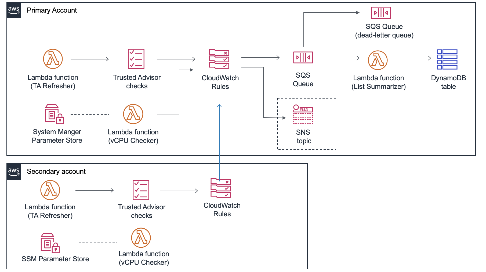

# AWS中国区资源监控解决方案

AWS中国区资源监控解决方案主要用来监控中国区资源的使用情况，并且在即将达到以及达到后发出通知，以提醒您提高limit或者删掉不再使用的资源。
此解决方案主要是通过 [Trusted Advisor](https://aws.amazon.com/cn/premiumsupport/technology/trusted-advisor/) 的监控以及 EC2 vCPU limit 两个方式来联合实现的。
包含两个模板，一个用于主账号部署，一个用于其他账号的联合部署（可选）。
如果您希望在 Global 区域而不是中国区部署此套解决方案，请点击[这里](https://aws.amazon.com/cn/solutions/limit-monitor/)部署。


## INTERNAL TODO 
1. 三个template里面，现在都用的是我自己的桶的名字，需要替换为solutions专门的bucket，并且在对应的bucket按照格式上传代码以及模板
1. 我跟西云申请过，得到的答复是 INTERNAL 没法开启 business support，所以 TA 那部分我现在验证不了，basic plan下，TA 在console上是可以看的，但是API需要premium support
1. TA 中国区能监控的很少，不知道是因为business support没开还是本来就这么多，待确认

## 监控资源
本解决方案主要监控两种类型的资源。
1. EC2 vCPU limits。自 2020 年 3 月起，AWS 的资源限制已经由过去的不同 instance type 的数量限制，转为 vCPU 数量的限制。具体说明请[点击这里查看](https://www.amazonaws.cn/new/2020/amazon-ec2-vcpu-on-demand-instance-limits-aws-china-regions/)。本方案中已经使用了 vCPU 数量来作为判断。
1. Trusted Advisor 能监控到的资源。请点击控制台 Trusted Advisor，选择"服务限制"，这里可以看到 TA 能监控到的限制种类。默认情况下，所有资源都会被监控，如果有定制化需求，可以修改template中的自定义值。

## 架构图


## 前提条件
1. 如果想完整的使用此解决方案的全部功能，请开通 AWS Business support 或者 Enterprise Support。如果是默认的 basic support，此解决方案仅提供对 on-demand vCPU 的查询。有关于不同 support 的对比，请点击[此页面](https://aws.amazon.com/cn/premiumsupport/plans/)
1. 将此模板部署在北京区 cn-north-1，可同时开启北京和宁夏两个区域资源的检查。

## 使用方法
此解决方案支持跨账号的监控。可以选择部署在一个账号下，也可以部署在多个账号下。

### 主账号下
1. [点击此处]()在北京区启动template。
1. 自定义参数
   - 账号ID列表: 如果只有一个账号，这里留空。如果用于两个或者两个以上的账号，需要填写所有的账号ID，引号包裹，逗号分隔，如 "12345678910","10987654321""
   - 本账号ID : 本账号
   - IAM 用户名: IAM用户名，此IAM用户需要有查看AWS EC2 Limit的权限，，且只需要这个权限
   - IAM 密码：对应的密码
   - Email 通知登记: 什么情况下发EMAIL通知
   - Email地址：邮箱地址
1. 其他选项默认，最后点击两个复选框同意创建资源，启动模板。
1. 在模板启动

### 其他账号下   
1. [点击此处]在北京区启动spoke.template 
1. 自定义参数
   - 主账号ID：启动了limit-monitor.template的主账号
   - 本账号ID
   - IAM 用户名：本账号的一个IAM User，此IAM用户需要有查看 AWS EC2 Limit 的权限，且只需要这个权限
   - IAM 密码：对应密码
1. 其它选项默认，最后点击两个复选框同意创建资源，启动模板。


## 自定义化

### template 的自定义项
1. lambda运行的间隔。默认情况下，每24小时刷新一次 Advisor Service 的 limit 限制。如需更改频率，请修改以下参数
   ```
   RefreshRate:
       CronSchedule:
         Default: rate(1 day)
   ```
1. 其他参数，如lambda的运行时，超时，内存等。

### 自定义化代码

- git clone 此 repo，自定义修改代码
- 在你的 AWS 账户下，提前创建好两个桶，假设其中一个 bucket 的名字为 your-bucket-name, 则另一个桶应该命名为 your-bucket-name-cn-north-1。
前者用于存放 cloudformation template，后者用于存放代码。

- 运行 build 脚本
   ```
   export OUTPUT_BUCKET=your-bucket-name  #template应该在的桶
   export VERSION=v1.0  # 版本号，自定义
   export SOLUTION_NAME=limit-monitor #解决方案的名字，会与版本号一起作为 S3 的前缀
   ./build-s3-dist.sh $OUTPUT_BUCKET $SOLUTION_NAME $VERSION $OUTPUT_BUCKET

   ```
- 将生成的代码以及template分别复制到对应的目录下
   ```
   aws s3 cp ./dist/global-s3-assets/ s3://my-bucket-name/limit-monitor/v1.0/ --recursive --exclude "*" --include "*.template" --acl bucket-owner-full-control --profile aws-cred-profile-name 
   aws s3 cp ./dist/regional-s3-assets/ s3://my-bucket-name-cn-north-1/limit-monitor/v1.0/ --recursive --exclude "*" --include "*.zip" --acl bucket-owner-full-control --profile aws-cred-profile-name 
   ```
- 公开 template 以及代码 (make public)
- 拿到 limit-monitor.template 的 URL，用于 cloudformation 的部署。
> 如果代码改动很小，不需要重新 npm install/ build，一种更简单的修改方式为，直接修改对应代码，将新的代码压缩后上传到对应的目录，然后更改 SourceCode里面的配置桶定义。留意，两个bucket name都应该为your-bucket-name，lambda code会自动去your-bucket-name-cn-north1里面拿。
   ```
   SourceCode:
     General:
       S3Bucket: cf-templates-1hc09qho4b94m
       KeyPrefix: "limit-monitor/v3.0"
       TemplateBucket: cf-templates-1hc09qho4b94m
   ```

## 代码文件结构
共包含4个lambda函数的代码

```
|-source/
  |-services/
    |-customhelper/ [ microservice for handling cloudformation custom resources ]
      |-lib/
        |-[ service module unit tests ]
        |-index.js [main module]
        |-logger.js [logger module]
        |-metrics-helper.js [ helper module for sending anonymous metrics ]
      |-index.js [ injection point for microservice ]
      |-package.json
    |-limitreport/ [ microservice for summarizing service limits ]
      |-lib/
        |-[ service module unit tests ]
        |-index.js [main module]
        |-limit-report.js [message handling module]
        |-logger.js [logger module]
      |-index.js [ injection point for microservice ]
      |-package.json
    |-tarefresh/ [ microservice for refreshing TA checks ]
      |-lib/
        |-[ service module unit tests ]
        |-index.js [main module]
        |-logger.js [logger module]
        |-ta-refresh.js [TA checks module]  
      |-index.js [ injection point for microservice ]
      |-package.json   
```


